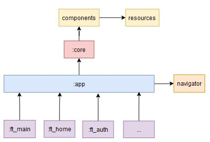

# BaseApplication
Base application to use and create multiple apps!.


##TESTING

For testing I have used JUnit5 for Unit testing and Jacoco for coe coverage report.01

All the dependencies are added in the core `build.gradle` file

```
dependencies {
 ...
 api testing.values()
}
```

That are defined in the `dependencies.gradle` file

```
    testing = [
            jupiter_api          : "org.junit.jupiter:junit-jupiter-api:${versions.jupiter_version}",
            jupiter_engine       : "org.junit.jupiter:junit-jupiter-engine:${versions.jupiter_version}",
            jupiter_parameterized: "org.junit.jupiter:junit-jupiter-params:${versions.jupiter_vintage}",
            jupiter_vintage      : "org.junit.vintage:junit-vintage-engine:${versions.jupiter_version}",
            mockito_kotlin       : "org.mockito.kotlin:mockito-kotlin:${versions.mockito_version}",
            mockito_jupiter      : "org.mockito:mockito-junit-jupiter:${versions.mockito_jupiter}",
            mockito_core         : "org.mockito:mockito-core:${versions.mockito_core}",
            mockito_inline       : "org.mockito:mockito-inline:${versions.mockito_inline}",
            coroutines_test      : "org.jetbrains.kotlinx:kotlinx-coroutines-test:${versions.coroutines_test_version}",
            core_ktx_testing     : "androidx.arch.core:core-testing:${versions.core_testing}",
    ]
```

All the Unit tests are collected under the `test` folder.

Once we have all the Unit tests created and working. We are able to start reporting the code coverage.01

For that, I have applied the Jacoco plugin in the `jacoco.gradle` file.

- To see tests results -> build >> tests >> index.html

- To see Jacoco reports -> build >>reports >> testDebugUnitTestCoverage >> html >> index.html


##APP STRUCTURE

The app has different modules that will be increased. At this moment exists common modules that all feature modules will depend.

- core -> Has all the common code that will be used for the entire app. Included app, navigator and all the features modules.

- app -> Is just the application module, has no logic.

- navigator -> Contains the implementation for the navigation of each feature.

- resources -> Core has a dependency of this module. That module contains all the common resources for the entire app. The resources that are specific for a module, will be declared in the res folder of this module.

- ft_xxx -> The feature module contains the implementation of the feature that will be included in the app (ft_landing, ft_home, etc).





##FUTURE WORK

    - Add Sonar/Codecov and Bitrise.
    - Improve documentation
    - Migrate to JetPack Compose

## FEATURES
    - Remember user and password
    - Add Biometric to login
    - Add push notification
    - Add reminder

## BUGS / REFACTOR
    - Loader always visible when swipe down
    - Check if there are unused dependencies
    - Review all TextView styles and unify
  
References:

- ListAdapter -> https://proandroiddev.com/android-data-binding-listadapter-9e72ce50e8c7
- Testing LiveData in JUnit 4 & JUnit 5 -> https://jeroenmols.com/blog/2019/01/17/livedatajunit5/
- ViewModelScope -> https://medium.com/androiddevelopers/easy-coroutines-in-android-viewmodelscope-25bffb605471